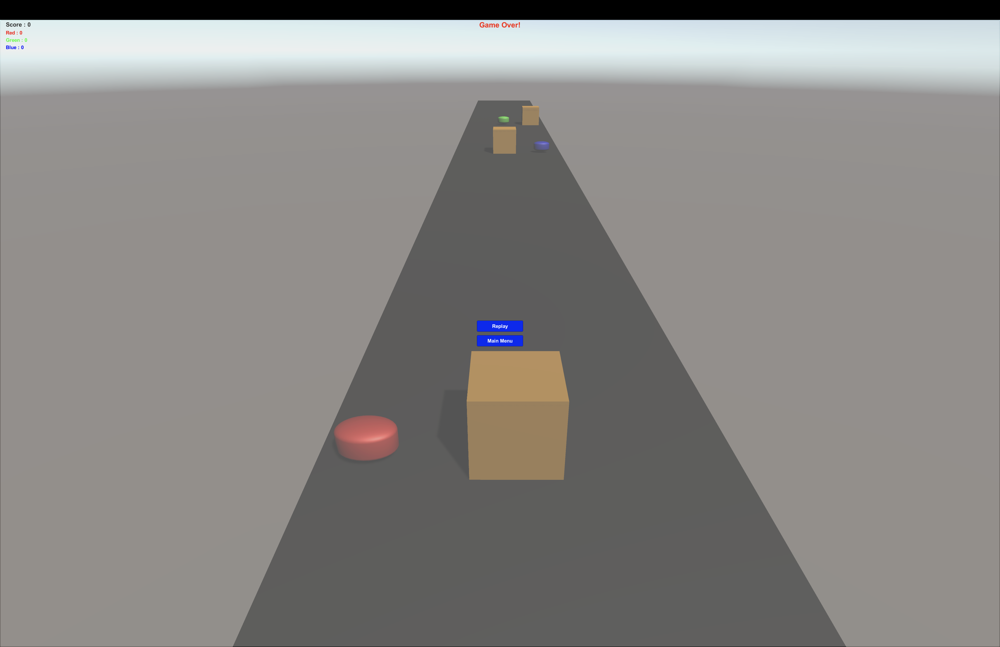

# Endless Runner - Power Rangers

A fast-paced, high-action endless runner game inspired by the **Power Rangers** universe. Dodge obstacles, collect power-ups, and survive as long as possible.[cite: 1]


## 🚀 Features
- **Dynamic Movement:** Smooth lane-switching and jumping mechanics.[cite: 2]
- **Thematic Assets:** Models and environments inspired by Power Rangers.[cite: 2]
- **Performance Optimized:** Efficient object pooling for obstacles and path segments.[cite: 2]
- **Cross-Platform:** Designed for both Mobile and Desktop play.[cite: 2]

## 🛠️ Technical Setup
1. **Unity Version:** 2022.3+[cite: 1]
2. **Installation:**
   ```bash
   git clone https://github.com/MuhammadMagdyy/EndlessRunner-PowerRangers.git
   ```[cite: 2]
3. **Open:** Open the project via Unity Hub. (Note: The `Library` folder is ignored and will generate locally).[cite: 1, 2]

## 📸 Screenshots
| Main Menu | Gameplay | Game Over |
| :---: | :---: | :---: |
|  |  |  |

---
*Developed by Muhammad Magdy*[cite: 1]
