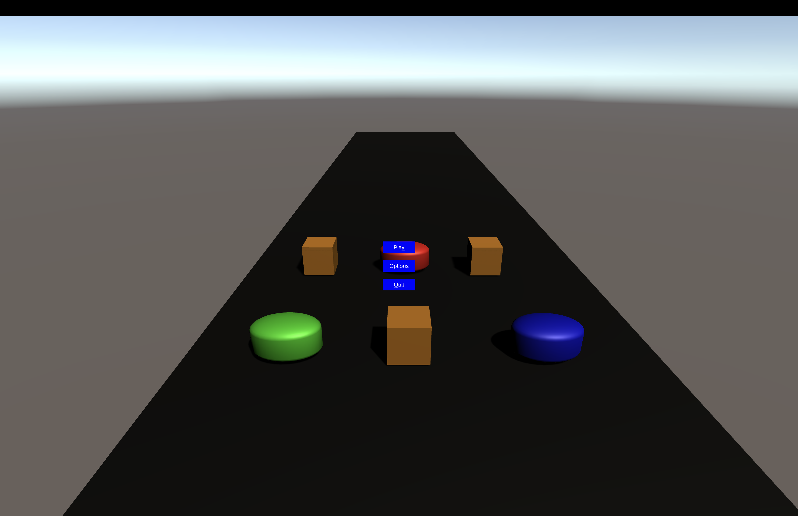
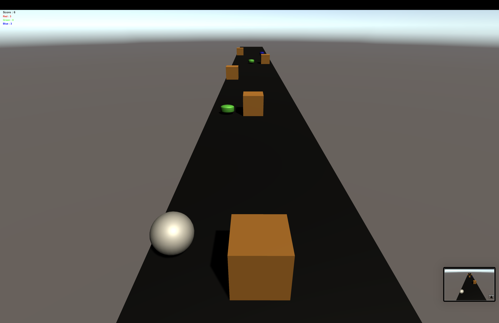
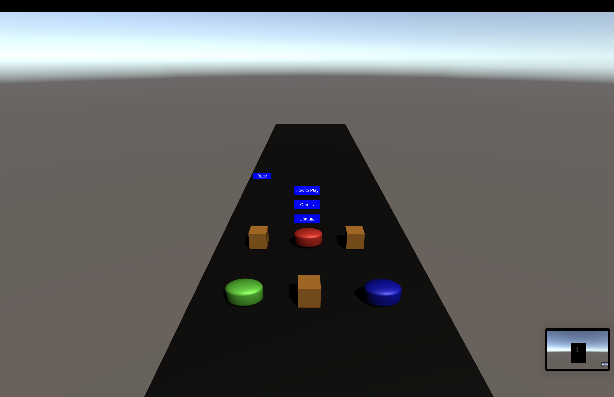

# ⚡ Go Go Power Rangers: Infinite Runner

An endless runner game developed in **Unity** and **C#**, featuring form-switching mechanics, dynamic resource management, and multi-platform support.

---

## 🎮 Gameplay Overview
The game follows the mechanics of a 3-lane infinite runner. The player controls a sphere moving forward automatically, aiming for the highest score while managing energy resources and avoiding lethal obstacles.

*Figure 1: The 3-lane environment featuring procedural item generation.*

### Core Mechanics
* **Automatic Movement:** Constant forward momentum independent of frame rate.
* **Lane Switching:** Controlled via A/D or Arrow keys (Windows) and Swipes (Android).
* **Forms & Energy:** The player starts in a **Normal (White)** form. Collect Red, Green, and Blue orbs to build energy (max 5 points).
* **Form Switching:** At 5 energy points, players use **J, K, or L** to transform. Switching consumes 1 energy point.

---

## 🛠 Power-Ups & Form Logic

When in a specific form, you can trigger a unique power using the **Space Bar** (costs 1 energy point).

| Form | Power Name | Effect |
| :--- | :--- | :--- |
| **🔴 Red** | **Nuke** | Eliminates all currently existing obstacles ahead of the player. |
| **🟢 Green** | **Multiplier** | The next orb collected gives 5x score and 2x energy. |
| **🔵 Blue** | **Shield** | Protects the player from exactly one obstacle collision. |

*Figure 2: Visual feedback during Power-up activation.*

---

## ⚠️ Obstacles and Damage
* **Normal Form:** Hitting an obstacle ends the game immediately.
* **Colored Form:** Hitting an obstacle reverts the player to Normal Form but saves them from a Game Over.
* **Generation Rules:** Items are pooled for performance. A line can have up to 2 obstacles, ensuring there is always a clear lane for the player.

---

## 🖥 User Interface (UI)

*Figure 3: The Main Menu featuring Play, Options, and Credits.*

* **HUD:** Displays real-time numerical values for Red, Green, and Blue energy, alongside the current Score.
* **How to Play:** A dedicated screen within the Options menu explaining the button mappings and rules.
* **Pause/Game Over:** Accessible via **Escape**, allowing for restarts or returning to the main menu.

---

## ⌨️ Controls Reference

| Action | Windows | Android |
| :--- | :--- | :--- |
| **Move Left/Right** | A / D or Arrows | Swipe Left / Right |
| **Switch Red/Green/Blue** | J / K / L | Left-side Stacked Buttons |
| **Activate Power** | Space Bar | Right-side Button |
| **Pause** | Escape | Top Button |

### 🔓 Developer Cheats
* **U:** Toggle Invincibility (No obstacle damage).
* **I / O / P:** Instant +1 Energy for Red, Green, or Blue.

---

## 🎵 Audio & Feedback
* **Soundtracks:** Features a slow-paced menu track and a high-energy gameplay track.
* **SFX:** Audio triggers for orb collection, form switching, power usage, collisions, and invalid actions.

---

## ⚙️ Technical Details
* **Engine:** Unity
* **Language:** C#
* **Builds:** Standalone Windows and Android APK.
EOF
